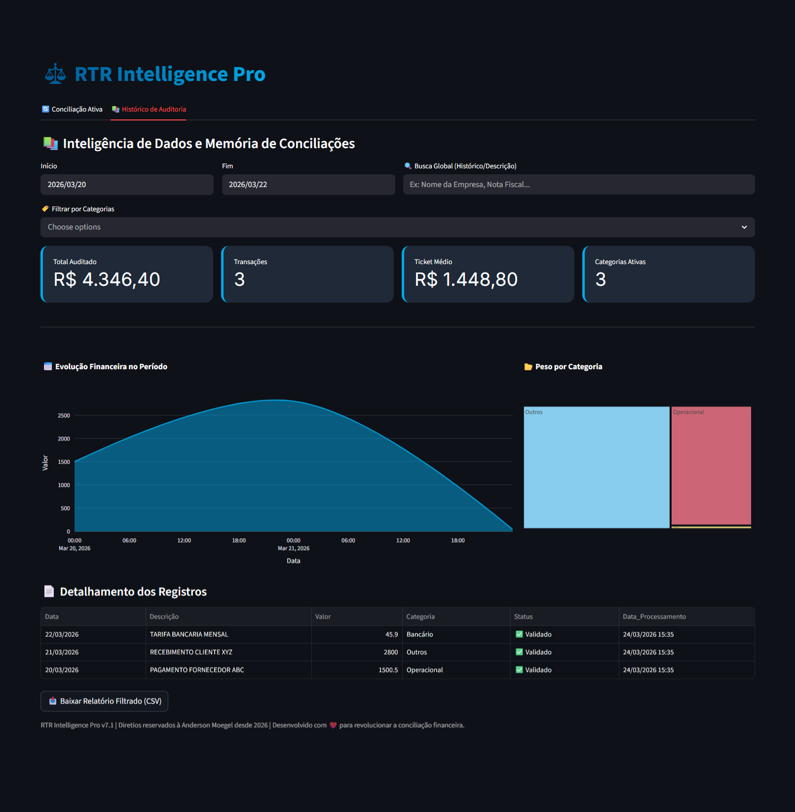
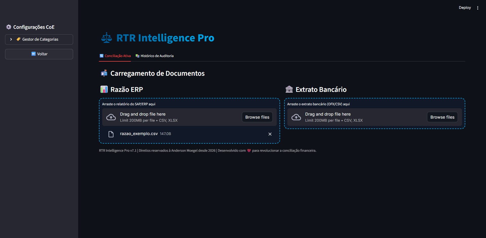
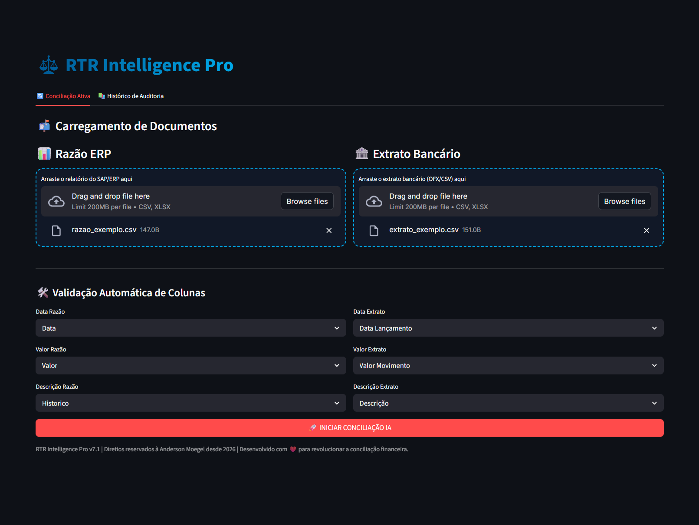

# ⚖️ RTR Intelligence Pro

Sistema inteligente de **conciliação financeira automatizada** com interface interativa via **Streamlit**, focado em eficiência operacional, auditoria e análise de dados.

---

## 📌 Visão Geral

O **RTR Intelligence Pro** é uma aplicação que automatiza o processo de conciliação entre:

* 📊 **Razão ERP (SAP/CSV/Excel)**
* 🏦 **Extrato Bancário (CSV/Excel)**

Utiliza técnicas de:

* Normalização de dados financeiros
* Matching por valor + janela temporal
* Similaridade textual (*fuzzy matching*)
* Classificação automática por regras

Além disso, mantém um **histórico persistente** para auditoria e análise BI.

---

## 🚀 Funcionalidades

### 🔄 Conciliação Inteligente

* Upload de arquivos ERP e bancários
* Mapeamento automático de colunas
* Match baseado em:

  * Valor exato
  * Janela de datas (±3 dias)
  * Similaridade textual (fuzzy)

### 🤖 Classificação Automática

Regras baseadas em regex:

* Bancário
* Impostos
* Operacional
* RH
* Outros

### 📊 Dashboard Interativo

* Volume total conciliado
* Status (validado vs pendente)
* Gráficos:

  * Barras por categoria
  * Pizza de status

### 🔍 Auditoria Manual

* Revisão detalhada linha a linha
* Comparação ERP vs Banco
* Confirmação manual de lançamentos
* Reclassificação de categorias

### 💾 Persistência (Histórico)

* Armazenamento em CSV (`historico_conciliacao.csv`)
* Registro de data de processamento
* Base para auditoria futura

### 📚 BI de Histórico

* Filtros por:

  * Data
  * Categoria
  * Texto
* Métricas:

  * Total auditado
  * Ticket médio
* Visualizações:

  * Linha temporal
  * Treemap por categoria

---

## 🖼️ Interface

## 📷 Demonstração

### Tela Principal


### Upload de Arquivos


### Dashboard


### Auditoria


---

## 🛠️ Tecnologias Utilizadas

* **Python 3.10+**
* **Streamlit**
* **Pandas**
* **Plotly**
* **FuzzyWuzzy**
* **Regex (re)**

---

## 📦 Instalação

```bash
git clone https://github.com/seu-usuario/rtr-intelligence.git
cd rtr-intelligence
pip install -r requirements.txt
```

### Dependências principais:

```txt
streamlit
pandas
plotly
fuzzywuzzy
python-Levenshtein
openpyxl
```

---

## ▶️ Execução

```bash
streamlit run app.py
```

---

## 📂 Estrutura do Projeto

```bash
rtr-intelligence/
│
├── app.py
├── historico_conciliacao.csv
├── imagens/
│   ├── tela_principal.png
│   ├── upload.png
│   ├── dashboard.png
│   └── auditoria.png
├── requirements.txt
└── README.md
```

---

## ⚙️ Lógica de Conciliação

### Critérios de Match:

| Critério     | Regra                  |
| ------------ | ---------------------- |
| Valor        | Igual                  |
| Data         | ± 3 dias               |
| Similaridade | > 75% (fuzzy matching) |

### Status:

* ✅ Validado
* 🟡 Sugestão IA
* 🔴 Pendente

---

## 📈 Possíveis Evoluções

* Integração com APIs bancárias (Open Banking)
* Machine Learning para classificação
* Banco de dados (PostgreSQL / SQLite)
* Deploy em cloud (AWS / Azure)
* Autenticação de usuários

---

## 🧠 Casos de Uso

* Financeiro corporativo (RTR / Accounting)
* Auditoria interna
* Conciliação bancária automatizada
* Redução de esforço manual em operações financeiras

---

## 📜 Licença

MIT - Uso educacional e para evolução em projetos. 

---

## 👨‍💻 Autor

**Anderson Moegel**
RTR Intelligence Pro © 2026
